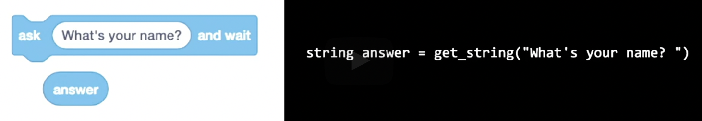
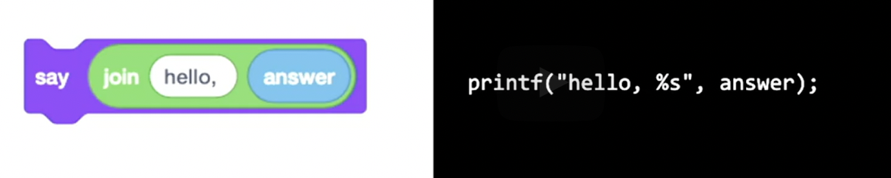
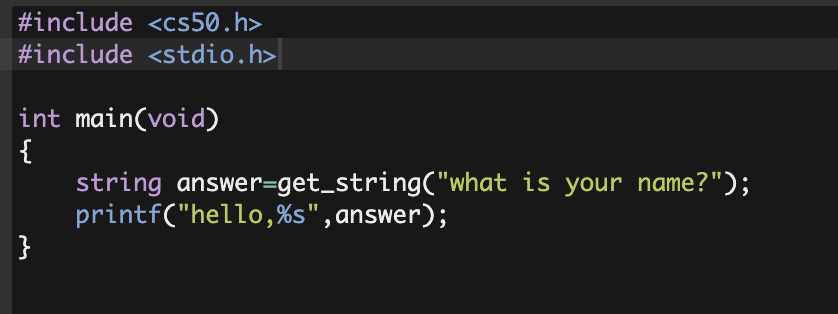
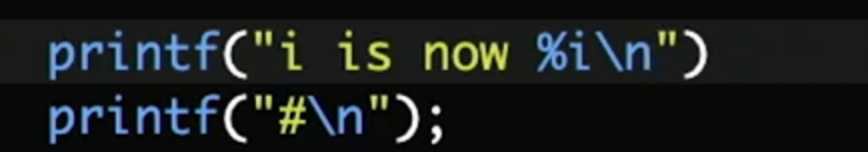

tag:: CS

-
- Reference and Links and Resources
	- [Stanford CS101 syllabus](https://web.stanford.edu/class/cs101/bits-bytes.html)
- ## week 0
collapsed:: true
	- status:
		- finished [[Feb 22nd, 2022]]
		- review:
	-
	- **ASCII** concept
		- 1 bit means 0 or 1;
		- 1 byte== 8 bits
			- ie 00110110 or 11111111
			- 2^8==256 possibilities
		- 1 pixel==3 bytes forming RGB which gives you color
		- 1 character takes up a place within the ASCII 256 seats, using 1 byte
			- DLC version of ASCII: **UNICODE** for other languages and words
			- unicode usually take up 2 bytes.
	- File extensions or formats: video, audio, png vs jpeg... ALL are 0s and 1s arranged in an agreed upon format
	- Ambiguity of language or algorithms: #inspiration
	- Playing the Scratch game: very intuitive. examples including
		- loops, following cursors, counting, bouncing, short gifs
		- plz dig deep into this game and get a better understanding of it #LATER
	-
-
-
- ## week 1
collapsed:: true
	- coding principles: correct, style, design (logos, pathos, ethos) #
	- GUI vs CUI (graph vs code)
	- CS50 IDE
	- some concepts of C
		- ==COMPILER==: source code in, machine code (those that can be understood by computers, namely 0 and 1)
		- ==argument==: smth like parameters
		- ==function==
			- ie printf(); get_string();
		- ==format code==: ie %s
		- ==header==: ie cs50.h and stdio.h (standard input n output) #syntax/C
		- side-effects; output of function? #what
	- Examples
		- 1. string _answer_ = get_string("xxx");
		  
		- 2. printf("hello, %s", _answer_)
		  
		- and here's the whole code in compiler: 
		- #+BEGIN_CAUTION
		  1. Remember the semicolon ";"
		  2. Need to re-compile every time you make a change
		  #+END_CAUTION
	- Some advice and help: check50, help50, style50;
		- ie to add //xxx as comments #syntax/C
	- GOOD question: hello vs hello.c
		- binaries vs ASCII; for computers vs for human
		- #+BEGIN_TIP
		  try opening hello in your compiler;
		  #+END_TIP
	- ---
	- [[2022/02/23]] continue learning video 54:40
	- common commands practicing in IDE:
		- rm(to delete a file), mv(change name or move a file into a dir),
		- directory: cd(change default dir to), mkdir(create a dir), rmdir(delete it)
		- dot-dot:  you can 
		  ``` 
		  cd ..
		  // to make parent dir as your default dir
		  mv xxxx.c 
		  ```
	- Examples: IDEcase in addition and division; get_int and get_long
	- #+BEGIN_IMPORTANT
	  Basic Data type: char, int, long, float, double
	  Derived data type: array, pointer structure union
	  Enumeration: enum
	  **Void**: void
	  #+END_IMPORTANT
		-
		- **Conditions**: if, else if, else;
		- **Loops**: for loop and while loop; do-while loops #what ;
			- be careful about the **scope;**
		- Void: similar to Algebraic expression 代数式;
			- PROTOTYPE: Add new function at the top of the lines (书签)
		- CAST: transform between different data types;
		-
	- Example: the mario question and the nested grids(3*3) flow;
	-
	- IMPERFECTION of coding a/o computers:
		- Floating Imprecision: as in 1/10=0.100000?
		- Integer overflow: see Jan 19th 2038 and unix time [link](https://en.wikipedia.org/wiki/Year_2038_problem)
	- END
	- #inspiration :
		- think in ways of IN-FUNCTION-OUT, 你细品；
		- coding的次序很像dna-rna-protein，包括preprocessing等步骤；
		- imprecision和**simulation**：计算机与人都有对现实的拟合与近似；
		-
	-
-
- ## week 2
collapsed:: true
	- 20:10 [[2022/02/23]] BEGIN
	- COMPILE: to translate source code into machine code;
		- there ARE other steps: preprocessing, compiling, assembling, linking
		- -clang is like your compiler(?)
		- the whole process: source code-assembly code-machine code(010110011)
	- Debug: to run program step by step and find problem; "复盘"
collapsed:: true
		- Example: double printf()! 
		- TOOL: debug 50; GDB system [GDB](https://cs.baylor.edu/~donahoo/tools/gdb/tutorial.html)
			- A good example: ADD a counter/marker
		- **breakpoint**;
	- #+BEGIN_TIP
	  1. ctrl+C==quitting !
	  2. You only need 1 float to turn the whole calculation to become float
	  #+END_TIP
	- #what video 40:00-45:00 about the get_negative_int
		- 1. the code itself
		  2. the debugging interface
	- #+BEGIN_IMPORTANT
	  Inviting the concept of **ARRAY**
	  #+END_IMPORTANT
		- the example 72, 73, 33
			- introduce "constant": parameters that dont change throughout
			- introduce "array": like the concept of database in R; for automation
			- introduce "average": a for loop function coined by him
- ## week 2 continuation
  id:: 622085ed-b6d4-454f-ba6b-36e66207fe00
	- 17:14 [[2022/03/03]]
	- #+BEGIN_IMPORTANT
	  array需要total（length）但是function不需要定义这一项；
	  单个character需要用单引号; including '\0'
	  #+END_IMPORTANT
	- String:  new code strlen (string length) from a new codebank
	- **example1**: turn brian into BRIAN
	- **example2:** turn brian to b r i a n
	- command-line arguments: argc and argv
		- **example3**: export hello world or hello xxx using ifelse
		- #+BEGIN_NOTE
		  Some syntax:
		  &&= and; <= and >=; s[][] as in array of array
		  #+END_NOTE
	- Cryptography and "be sure to drink ovaltine"
	- **example4**: "404" simulation
	- END\0; a lot of codes but the concept is clear.
-
- ## week 3
	- 21:20 [[2022/03/03]]
	-